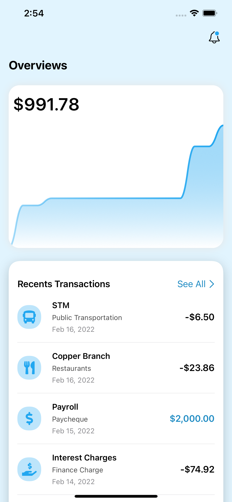
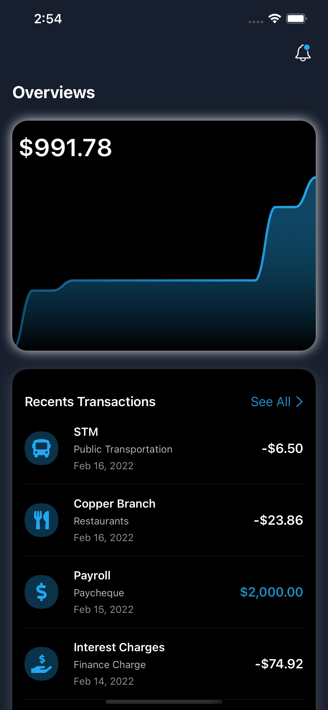

# ExpenseTracker
Expense Tracker for iOS App with SwiftUI

## Todo
- add custom insert expensed
- modified for local database

## Demo
| Light Mode | Dark Mode |
| :---------: | :---------: |
|  |  |

## Reference from
[here](https://www.youtube.com/watch?v=Bu6fAlltatA&list=PLDaHCLWmCcQLL-3YDxnPgG8VENNUiJ0Nv&index=8)

## Buy me coffee ☕️
| Shiba      | BTC      | ETH      | Doge |
|------------|-------------|-------------|-------------|
|  |  |  |  | 
